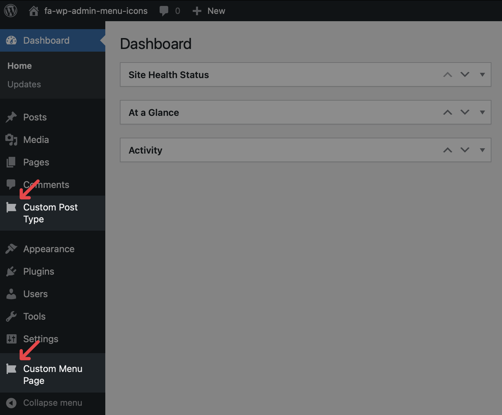
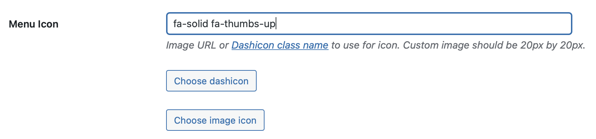

# FA WP Admin Menu Icons

**FA WP Admin Menu Icons** allows you to use Font Awesome icons for WordPress custom post types and custom menu pages by passing the Font Awesome class string, just like using Font Awesome on the front end



Here's an example:

```php
register_post_type( 'custom_post_type', [
    //...
    'menu_icon' => 'fa-solid fa-thumbs-up',
    //...
] );
```

See [Usage](#usage) for more examples

## Requirements

- WordPress v4.4+
- PHP v8.1+
- [SimpleXML PHP extension](https://www.php.net/manual/en/simplexml.installation.php) (enabled by default)

## Installation

### WordPress Admin Dashboard

In your WordPress Admin Dashboard, go to **Plugins > Add New**, search for 'fa wp admin menu icons', then click **Install Now**

Read more about [automatic plugin installation with the WordPress Admin Dashboard](https://wordpress.org/support/article/managing-plugins/#automatic-plugin-installation-1)

### WP-CLI

Install with WP-CLI by running the following command:

```sh
wp plugin install fa-wp-admin-menu-icons --activate
```

### Install with Composer

1. Follow the setup instructions for [WordPress Packagist](https://wpackagist.org)
2. Require `wpackagist-plugin/fa-wp-admin-menu-icons`

### Install with Git

Install with Git by running the following commands:

```sh
cd <wp-content>/plugins
git clone git@github.com:patrik-csak/fa-wp-admin-menu-icons.git
```

## Usage

### `register_post_type()`

To use a Font Awesome icon for your custom post type with [`register_post_type()`](http://developer.wordpress.org/reference/functions/register_post_type/), use a Font Awesome class string for the `$args['menu_icon]` parameter:

```php
register_post_type( 'custom_post_type', [
    //...
    'menu_icon' => 'fa-solid fa-thumbs-up',
    //...
] );
```

### `add_menu_page()`

To use a Font Awesome icon for your custom menu page with [`add_menu_page()`](http://developer.wordpress.org/reference/functions/add_menu_page/), use a Font Awesome class string for the `$icon_url` parameter:

```php
add_menu_page(
    page_title: 'Custom Menu Page',
    menu_title: 'Custom Menu Page',
    capability: 'manage_options',
    menu_slug: 'custom_menu_page',
    icon_url: 'fa-solid fa-thumbs-up',
);
```

### Custom Post Type UI plugin

To use a Font Awesome icon with the [Custom Post Type UI plugin](https://wordpress.org/plugins/custom-post-type-ui/), use a Font Awesome class string for the **Menu Icon** field when adding or editing a Post Type:



## Caveats

**FA WP Admin Menu Icons** only supports Font Awesome's [free icons](https://fontawesome.com/search?o=r&m=free)
